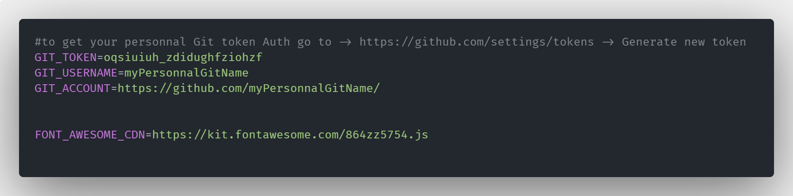
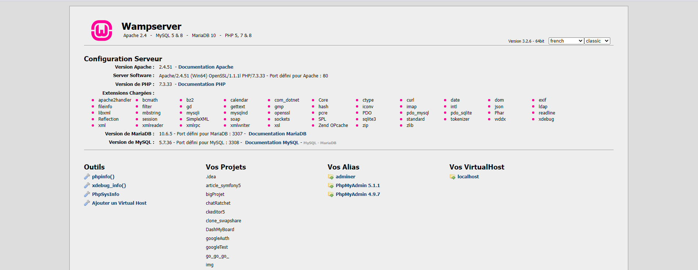
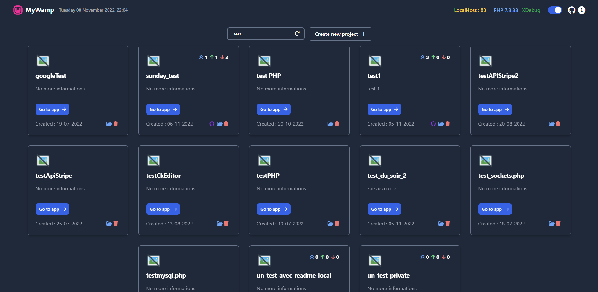
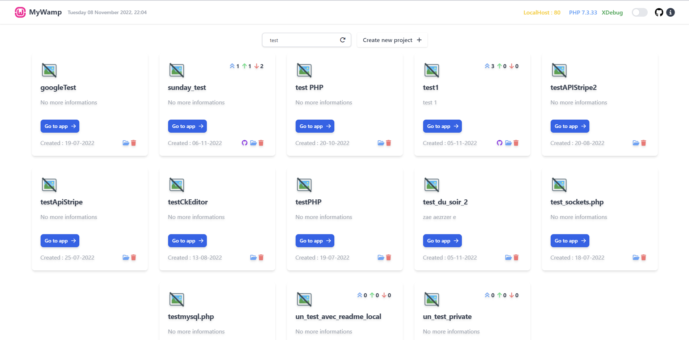
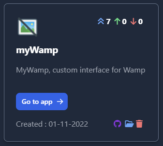
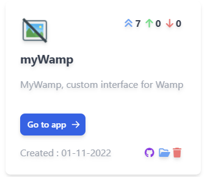
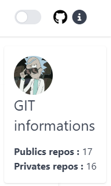

# MyWamp 1.3
Simple custom interface for Wamp
## How to install ?
- Find your **www** directory , where your is your localhost , for example mine is C:\wamp64\www
- Cloning the repository **myWamp** from github ( "https://github.com/mangozmorgan/myWamp.git" ) here 
- Find the **index.php** file in **www** and rename it to **indexBase.php**
- Open **myWamp** directory and cut **index.php** paste it to **www**
- Use **Composer** to install dependencies with **composer install** 
## How configure ? 
- Create a **.env** file at the **root** of the project like this example with your own datas

 

## Git features
- You can create a project directly from myWamp, the Github repository will be created and cloned in to your **www** directory
- If your project is linked to GitHub you have the possiblity to remove your repo on GitHub too 
- On every project linked with GitHub you have a tree little icons ( top right ) to indicate 
  - Number of files modified on your local project may be committed
  - Number of commits must be push
  - Number of commits behind from origin
- more soon ...
## Enjoy
Work in progress... .. . 👽

## Screenshots

### Normal localhost

### myWamp & Original theme

### myWamp & White theme

### New feature v1.2 💚

- Git indicator (change/push/pull) ( top right of project card )
- All your active extention can be finded by hit the info button on the right side of the topBar
- Indicator if X-Debug is enabled (  green when is it )

Dark theme            |  Clear theme | Git user infos
:-------------------------:|:-------------------------:|:---:
|||

